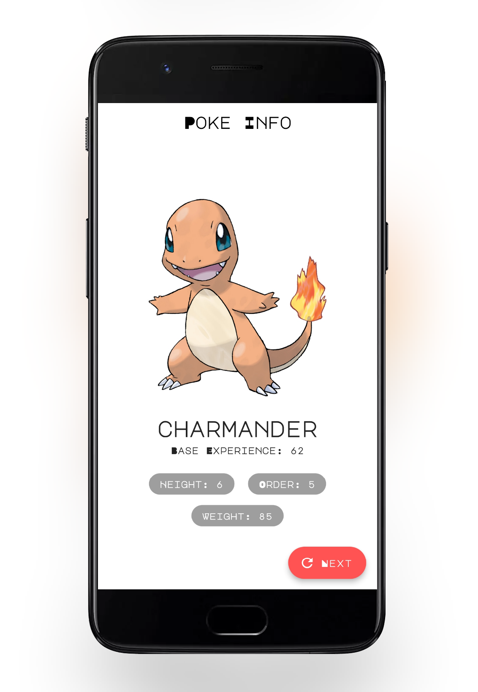
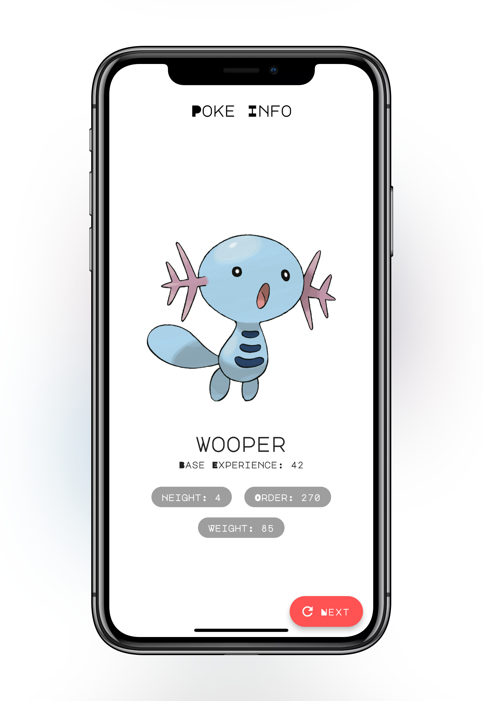

# Pokemon Info - Flutter App 

A simple Flutter Application for Flutter Create Participation.
Find out more about #FlutterCreate here: https://flutter.dev/create

## Features
 - Random Pokemon Information
 
## Screenshots
&ensp;
 
## Credits
 - Flutter Official Documentaion
 - Dart Official Documentation
 - Lovely Medium Articles
 - Stack Overflow
 
## Packages Used
 - [http](https://pub.dartlang.org/packages/http)
 - [flutter_launcher_icons](https://pub.dartlang.org/packages/flutter_launcher_icons)
 
## Developed By
 - Karan Balani [@krnblni](https://www.github.com/krnblni/)

## Resources Used / Data Sources
 - PokeApi => [Here](https://pokeapi.co/)
 - Pokémon Database => [Here](https://pokemondb.net/)
